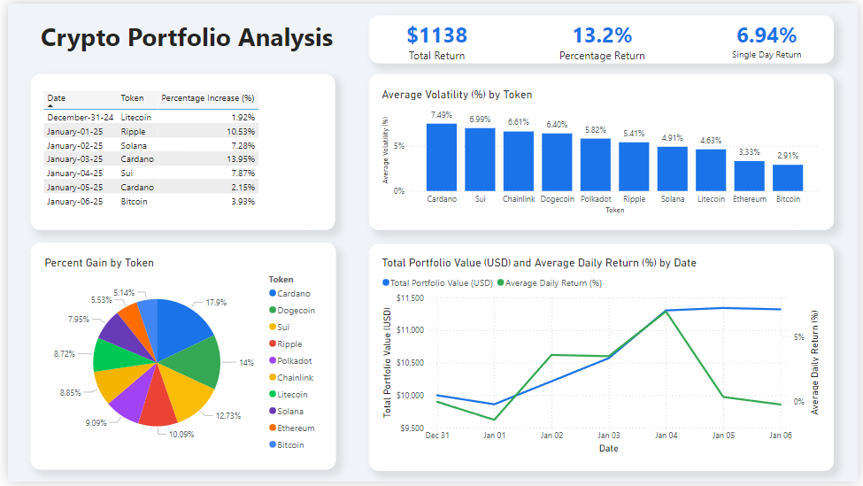

# Cryptocurrency Portfolio Analysis 

This repository presents a **Crypto Portfolio Analysis Dashboard** built using **Power BI**, integrating real-time cryptocurrency data, **SQL-based** analytics, and portfolio modeling. The project demonstrates an end-to-end workflow for portfolio analysis, including data fetching, processing, and visualization. It specifically models a portfolio that **tracks 10 of the top 20 cryptocurrencies, with an even allocation of a $10,000 portfolio over a 7-day period.**



---

## Features

- **Interactive Dashboard**:
  - Displays total returns, percentage returns, and daily returns of the portfolio.
  - Visualizes key metrics such as:
    - Portfolio performance by token.
    - Percentage gains across tokens.
    - Total portfolio value over time.
    - Average daily returns and token volatility.
- **Data Pipeline**:
  - Real-time cryptocurrency price data fetched from the **CoinGecko API**.
  - Analytical queries using SQL to compute:
    - Top-performing tokens.
    - Daily portfolio value and average returns.
    - Overall returns and volatility across tokens.

---

## File Structure

### 1. **cryptoanalysis.py**
This Python script fetches cryptocurrency data using the **CoinGecko API**. It pulls data for multiple tokens, processes it, and stores the results in a format ready for SQL-based analysis.

#### Key Functionalities:
- Fetches OHLC (Open-High-Low-Close) data for selected tokens.
- Outputs the data into a structured format for SQL processing.

### 2. **SQL.txt**
This file contains SQL scripts for:
- Identifying top-performing tokens for each day.
- Calculating daily portfolio values and average daily returns.
- Computing total returns over 7 days for each token.
- Measuring average volatility across tokens.

#### Example Queries:
- **Portfolio Value**:
  ```sql
  WITH daily_prices AS (
  -- Get first price of each day for each token
  SELECT 
    token,
    date,
    FIRST_VALUE(open) OVER (PARTITION BY token, date ORDER BY time) as daily_price
  FROM (
    SELECT 
      token,
      substr(date, 1, 10) as date,
      time,
      open
    FROM OHLC
  )
  GROUP BY token, date
),
tokens AS (
  SELECT COUNT(DISTINCT token) as token_count
  FROM daily_prices
),
portfolio_allocation AS (
  SELECT 
    daily_prices.*,
    ROUND(10000.0 / token_count, 2) as initial_allocation,
    ROUND((10000.0 / token_count) / FIRST_VALUE(daily_price) OVER (PARTITION BY token ORDER BY date), 6) as token_quantity
  FROM daily_prices, tokens
),
daily_values AS (
  SELECT
    date,
    token,
    daily_price,
    token_quantity,
    ROUND(token_quantity * daily_price, 2) as position_value,
    ROUND(((daily_price - LAG(daily_price) OVER (PARTITION BY token ORDER BY date)) / LAG(daily_price) OVER (PARTITION BY token ORDER BY date)) * 100, 2) as daily_return
  FROM portfolio_allocation
)
SELECT 
    date,
    ROUND(SUM(position_value), 2) as total_portfolio_value,
    ROUND(AVG(daily_return), 2) as avg_daily_return,
    GROUP_CONCAT(token || ': $' || position_value) as token_values
FROM daily_values
GROUP BY date
ORDER BY date; ```

### 3. **Dashboard.png**
A Power BI dashboard that visualizes:
- Portfolio metrics (returns, values, and daily trends).
- Volatility and percentage gains by token.
- Insights into daily and cumulative performance.

---

## Prerequisites

1. **Python**:
   - Install dependencies: `pip install requests`
   - Configure `cryptoanalysis.py` to fetch data for desired tokens and dates.
   
2. **SQL Database**:
   - Use any SQL-compatible database (e.g., SQLite, MySQL, PostgreSQL).
   - Load OHLC data exported from the Python script.

3. **Power BI**:
   - Import processed data from the SQL database.
   - Customize and explore the dashboard as needed.

---

## Usage Instructions

### Step 1: Fetch Cryptocurrency Data
Run the Python script to fetch OHLC data:
```bash
python cryptoanalysis.py
```

### Step 2: Analyze Data with SQL
Use the provided SQL queries to:
1. Calculate performance metrics.
2. Analyze token-specific data (e.g., volatility, returns).

### Step 3: Visualize in Power BI
1. Import processed data into Power BI.
2. Load the included `Dashboard.png` for reference or design your own dashboard using the same metrics.

---

## Example Workflow

1. **Data Fetching**:
   - The script fetches data for Bitcoin, Ethereum, Cardano, etc., over a specific date range.
   - Data is stored in the `OHLC` table with fields: `token`, `date`, `open`, `close`, `high`, `low`.

2. **SQL Queries**:
   - Run the SQL queries to generate intermediate results such as:
     - Daily percentage increases.
     - Volatility measures.
     - Portfolio value.

3. **Dashboard Insights**:
   - Visualize token-specific insights.
   - Compare daily and cumulative returns.

---

## Example Results

### **Total Returns**
| Token     | Return (%) |
|-----------|------------|
| Bitcoin   | 3.93%      |
| Cardano   | 13.95%     |
| Ethereum  | 2.91%      |

### **Average Volatility**
| Token     | Volatility (%) |
|-----------|----------------|
| Cardano   | 7.49%          |
| Sui       | 6.99%          |
| Bitcoin   | 2.91%          |

---

## Contributing
Contributions are welcome! Feel free to submit a pull request or open an issue for any improvements.
